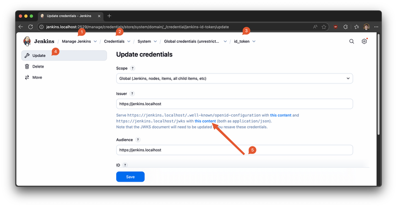
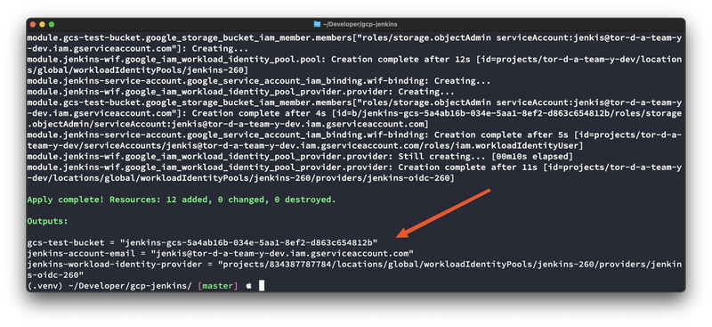
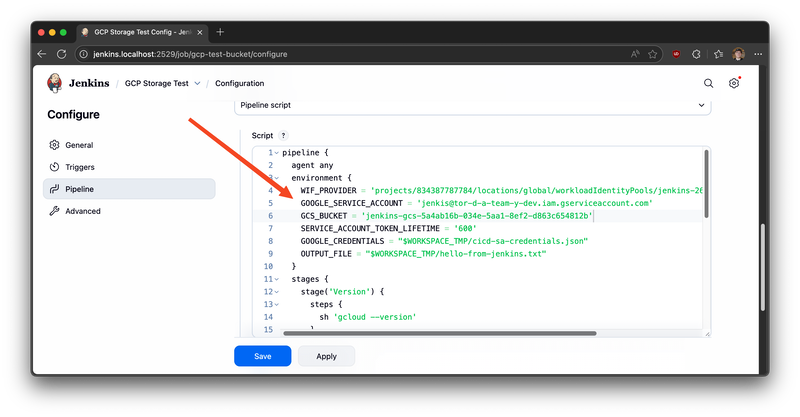

# Jenkins ❤️ Google Cloud with Workload Identity Federation

[](https://cloud.google.com/iam/docs/workload-identity-federation)
[](https://www.jenkins.io/)
[](https://opensource.org/licenses/Apache-2.0)

This repository provides a comprehensive blueprint and a practical example for running Jenkins in a containerized environment using Docker or Podman, while securely connecting to Google Cloud Platform (GCP) services. The key feature of this setup is the pre-configured [OpenID Connect (OIDC) Provider plugin](https://plugins.jenkins.io/oidc-provider/), which enables seamless and secure authentication with GCP through [Workload Identity Federation](https://cloud.google.com/iam/docs/workload-identity-federation).

By leveraging Workload Identity Federation, your Jenkins jobs can securely access Google Cloud resources without the need for long-lived service account keys. This approach significantly improves your security posture by eliminating the risks associated with managing and rotating static credentials. Instead, it uses short-lived access tokens, which are automatically managed by the OIDC provider.

This setup is ideal for CI/CD pipelines where Jenkins needs to interact with GCP services such as Google Kubernetes Engine (GKE), Google Cloud Storage, or Google Compute Engine.

## Prerequisites

Before you begin, ensure you have the following tools installed and configured on your system. These are essential for building, running, and managing the Jenkins environment and the associated cloud infrastructure.

*   **Container Runtime:** You'll need one of the following container solutions to run the Jenkins instance.
    *   [**Docker**](https://docs.docker.com/get-started/get-docker/) with [**Docker Compose**](https://docs.docker.com/compose/install/): A widely-used container platform. Docker Compose is used to define and run the multi-container Jenkins application.
    *   [**Podman**](https://podman.io/docs/installation) with [**Podman Compose**](https://github.com/containers/podman-compose): A daemonless container engine that provides a Docker-compatible command-line interface. Podman Compose allows you to run the same `docker-compose.yml` file.

*   [**Google Cloud CLI**](https://cloud.google.com/sdk/docs/install): The `gcloud` CLI is essential for interacting with your Google Cloud project. You'll use it to authenticate and manage GCP resources.

*   [**Terraform**](https://learn.hashicorp.com/tutorials/terraform/install-cli): An infrastructure as code (IaC) tool that allows you to define and provision the necessary GCP resources, such as the Workload Identity Pool and Provider, in a declarative and reproducible manner.

## Getting Started

Follow these steps to get your Jenkins instance up and running with GCP integration.

### 1. Clone the Repository

First, clone this repository to your local machine and navigate into the project directory.

```bash
git clone https://github.com/Cyclenerd/gcp-jenkins.git
cd gcp-jenkins
```

### 2. Start Jenkins

Launch the Jenkins container using your preferred container runtime. The `-d` flag starts the container in detached mode, running it in the background.

**With Docker:**

```bash
docker-compose up -d
```

**With Podman:**

```bash
podman-compose up -d
```

Once the container is running, you can access the Jenkins web interface at [http://jenkins.localhost:2529](http://jenkins.localhost:2529).

### 3. Configure Workload Identity Federation

To allow Jenkins to securely authenticate with Google Cloud, you need to set up Workload Identity Federation. This involves creating a trust relationship between your Jenkins instance and your GCP project.

#### Retrieve the JWKS URI

The JSON Web Key Set (JWKS) is a set of keys containing the public keys that Google Cloud will use to verify the authenticity of the OIDC tokens issued by Jenkins.



The JWKS is available at the following URI:

```text
http://jenkins.localhost:2529/manage/descriptorByName/io.jenkins.plugins.oidc_provider.IdTokenFileCredentials/jwks?id=jenkins-id-token&issuer=https://jenkins.localhost
```

You can download the JWKS file using `curl` and save it as `jenkins-jwk.json` in the root of this directory.

```bash
curl -o "jenkins-jwk.json" \
"http://jenkins.localhost:2529/manage/descriptorByName/io.jenkins.plugins.oidc_provider.IdTokenFileCredentials/jwks?id=jenkins-id-token&issuer=https://jenkins.localhost"
```

> [!IMPORTANT]
> To prevent a new key from being generated each time the container is restarted, you must now rename the `jcasc/credentials.yml` file to `jcasc/credentials.yml.NOT-ACTIVE`. This ensures that the same key is used across restarts, maintaining the trust relationship with GCP.

#### Create your Workload Identity Pool and Provider

With the JWKS file in place, you can now use Terraform to create the necessary GCP resources. The Terraform configuration in this repository will:
- Create a Workload Identity Pool.
- Create a Workload Identity Provider within that pool, configured to trust the OIDC tokens from your Jenkins instance.

Initialize Terraform and apply the configuration:

```bash
gcloud auth application-default login
terraform init
terraform apply
```

Terraform will prompt you to confirm the changes before applying them.

#### Adjust Jenkins Build

The final step is to configure the example Jenkins pipeline job, "GCP Storage Test," to use the newly created Workload Identity Federation configuration.

Navigate to the job configuration page: <http://jenkins.localhost:2529/job/gcp-test-bucket/>

You will need to update the pipeline script with the values from the Terraform output. Terraform will display these values after a successful `apply`.



Replace the placeholder variables in the Jenkins pipeline with the corresponding output values from Terraform.



## Usage

The `docker-compose.yml` file provides several commands for managing the lifecycle of your Jenkins instance.

*   **Stop Jenkins:**
    This command stops the running Jenkins container without removing it.

    ```bash
    # With Docker
    docker-compose stop

    # With Podman
    podman-compose stop
    ```

*   **Start Jenkins:**
    This command restarts a previously stopped Jenkins container.

    ```bash
    # With Docker
    docker-compose start

    # With Podman
    podman-compose start
    ```

*   **Stop and Remove Containers:**
    This command stops and removes the Jenkins container, along with any associated networks and volumes. Use this when you want to start fresh.

    ```bash
    # With Docker
    docker-compose down

    # With Podman
    podman-compose down
    ```

### Example OIDC Token

Here is an example of the OIDC token that is generated by the Jenkins OIDC provider plugin. This token is what Jenkins presents to Google Cloud to authenticate.

```json
{
  "iss": "https://jenkins.localhost",
  "aud": "https://jenkins.localhost",
  "exp": 1758922421,
  "iat": 1758918821,
  "sub": "http://jenkins.localhost:2529/job/gcp-test-bucket/",
  "build_number": 1
}
```

- `iss` (Issuer): The URL of the Jenkins instance that issued the token.
- `aud` (Audience): The intended recipient of the token.
- `exp` (Expiration Time): The time at which the token expires.
- `iat` (Issued At): The time at which the token was issued.
- `sub` (Subject): The subject of the token, which in this case is the Jenkins job build URL.
- `build_number`: The build number of the Jenkins job.

## Contributing

Contributions are highly welcome! If you have any improvements, bug fixes, or new features, please feel free to submit a pull request or open an issue.

## License

This project is licensed under the Apache 2.0 License. See the [LICENSE](LICENSE) file for more details.
